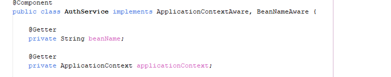
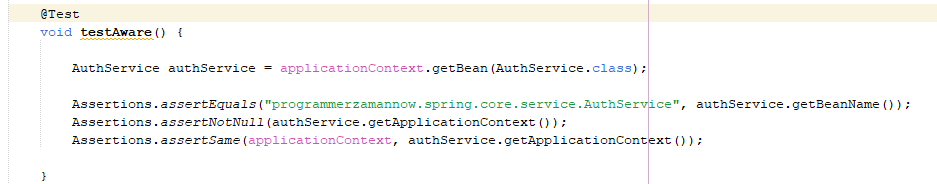

 
  
### Aware
* Spring memiliki sebuah interface berama Aware
* Aware adalah super interface yang digunakan untuk semua Aware interface
* Aware ini diperuntukkan untuk penanda agar Spring melakukan injection object yang kita butuhkan
* Mirip seperti yang sudah kita lakukan ketika membuat IdAware menggunakan IdGenerator Bean Post Processor
* Namun untuk ini, kita tidak perlu lagi membuat Bean Post Processor secara manual
* [https://docs.spring.io/spring-framework/docs/current/javadoc-api/org/springframework/beans/factory/Aware.html] 

### Daftar Aware
---------------------------------------------------------------------
|Aware               	       | Keterangan                         |
|------------------------------|------------------------------------|
|ApplicationContextAware	   |Untuk mendapat application context  |
|BeanFactoryAware	           |Untuk mendapat bean factory         |
|BeanNameAware	               |Untuk mendapat nama bean            |
|ApplicationEventPublisherAware|Untuk mendapat event publisher      |
|EnvironmentAware	           |Untuk mendapat environment          |
|dan lain-lain	...            |                                    |

* Code : Aware

* Kode : Mengakses Bean

