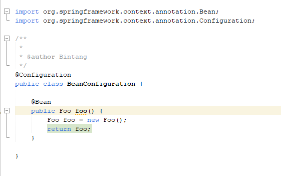

### Bean
* Saat sebuah object kita masukkan kedalam Spring Container IoC, maka kita sebut object tersebut adalah Bean
* Secara default, bean merupakan singleton, artinya jika kita mengakses bean yang sama, maka dia akan mengembalikan object yang sama. Kita juga bisa mengubahnya jika tidak ingin singleton, nanti akan kita bahas di materi tersendiri
Membuat Bean
* Untuk membuat bean, kita bisa membuat sebuah method di dalam class Configuration
* Selanjutnya nama method tersebut akan menjadi nama bean nya, dan return object nya menjadi object bean nya
* Method tersebut perlu kita tambahkan annotation @Bean, untuk menandakan bahwa itu adalah bean
* Secara otomatis Spring akan mengeksekusi method tersebut, dan return value nya akan dijadikan object bean secara otomatis, dan disimpan di container IoC
* Kode : Membuat Bean

* Penjelasannya :

 
### Mengakses Bean
* Setelah kita membuat bean, secara otomatis semua object akan di-manage oleh Application Context
* Untuk mengakses bean, kita bisa menggunakan method getBean milik Application Context
* Kode : Mengakses Bean
 
 
### Duplicate Bean
* Di Spring, kita bisa mendaftarkan beberapa bean dengan tipe yang sama
* Namun perlu diperhatikan, jika kita membuat bean dengan tipe data yang sama, maka kita harus menggunakan nama bean yang berbeda
* Selain itu, saat kita mengakses bean nya, kita wajib menyebutkan nama bean nya, karena jika tidak, Spring akan bingung harus mengakses bean yang mana
* Kode : Duplicate Bean
 
* Kode : Mengakses Duplicate Bean
 
 
### Primary Bean
* Jika terjadi duplicate bean, selain kita sebSecarautkan nama bean nya ketika ingin mengakses bean nya, kita  juga bisa pilih salah satu bean menjadi primary
* Dengan memilih salah satunya menjadi primary, secara otomatis jika kita mengakses bean tanpa menyebutkan nama bean nya, secara otomatis primary nya yang akan dipilih
* Untuk memilih primary bean, kita bisa tambahkan annotaiton @Primary
* Kode : Primary Bean
 
* Kode : Mengakses Primary Bean
 
 
### Mengubah Nama Bean
* Secara default, nama bean diambil dari nama method
* Namun kadang-kadang kita tidak ingin menggunakan nama method untuk nama bean
* Saat project kita sudah besar, kadang bisa jadi nama method sama, walaupun isi bean nya berbeda, dan di Spring, nama bean itu unik, tidak boleh sama
* Jika kita ingin mengubah nama bean, kita bisa menggunakan method value() milik annotation 
@Bean
* Kode : Mengubah Nama Bean
 
* Kode : Mengakses Bean
 

 
### Link Video Youtube
#### (TUTORIAL SPRING BOOT DASAR)
[https://www.youtube.com/watch?v=VM3rwdMBORY]