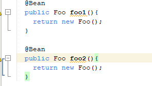
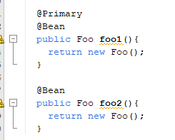
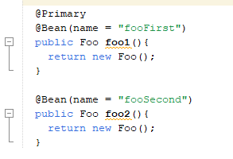

### Bean
* Saat sebuah object kita masukkan kedalam Spring Container IoC, maka kita sebut object tersebut adalah Bean
* Secara default, bean merupakan singleton, artinya jika kita mengakses bean yang sama, maka dia akan mengembalikan object yang sama. Kita juga bisa mengubahnya jika tidak ingin singleton, nanti akan kita bahas di materi tersendiri
Membuat Bean
* Untuk membuat bean, kita bisa membuat sebuah method di dalam class Configuration
* Selanjutnya nama method tersebut akan menjadi nama bean nya, dan return object nya menjadi object bean nya
* Method tersebut perlu kita tambahkan annotation @Bean, untuk menandakan bahwa itu adalah bean
* Secara otomatis Spring akan mengeksekusi method tersebut, dan return value nya akan dijadikan object bean secara otomatis, dan disimpan di container IoC
* Kode : Membuat Bean

 
### Mengakses Bean
* Setelah kita membuat bean, secara otomatis semua object akan di-manage oleh Application Context
* Untuk mengakses bean, kita bisa menggunakan method getBean milik Application Context
* Kode : Mengakses Bean
 
 
### Duplicate Bean
* Di Spring, kita bisa mendaftarkan beberapa bean dengan tipe yang sama
* Namun perlu diperhatikan, jika kita membuat bean dengan tipe data yang sama, maka kita harus menggunakan nama bean yang berbeda
* Selain itu, saat kita mengakses bean nya, kita wajib menyebutkan nama bean nya, karena jika tidak, Spring akan bingung harus mengakses bean yang mana
* Kode : Duplicate Bean
 
 

* Kode : Mengakses Duplicate Bean
 
 
### Primary Bean
* Jika terjadi duplicate bean, selain kita sebSecarautkan nama bean nya ketika ingin mengakses bean nya, kita  juga bisa pilih salah satu bean menjadi primary
* Dengan memilih salah satunya menjadi primary, secara otomatis jika kita mengakses bean tanpa menyebutkan nama bean nya, secara otomatis primary nya yang akan dipilih
* Untuk memilih primary bean, kita bisa tambahkan annotaiton @Primary
* Kode : Primary Bean

 
* Kode : Mengakses Primary Bean
 
 
 
### Mengubah Nama Bean
* Secara default, nama bean diambil dari nama method
* Namun kadang-kadang kita tidak ingin menggunakan nama method untuk nama bean
* Saat project kita sudah besar, kadang bisa jadi nama method sama, walaupun isi bean nya berbeda, dan di Spring, nama bean itu unik, tidak boleh sama
* Jika kita ingin mengubah nama bean, kita bisa menggunakan method value() milik annotation 
@Bean
* Kode : Mengubah Nama Bean

 
* Kode : Mengakses Bean

 

 
### Factory Bean
* Kadang ada kasus dimana sebuah class misal bukanlah milik kita, misal class third party library
* Sehingga agak sulit jika kita harus menambahkan annotation pada class tersebut
* Pada kasus seperti ini, cara terbaik untuk membuat bean nya adalah dengan menggunakan @Bean method
* Atau di Spring, kita juga bisa menggunakan @Component, namun kita perlu wrap dalam class Factory Bean
* [https://docs.spring.io/spring-framework/docs/current/javadoc-api/org/springframework/beans/factory/FactoryBean.html] 
* Kode : Payment Gateway Client

 
* Kode : Factory Bean
 

* Kode : Configuration

 
* Kode : Mengakses Bean

 
 
 
 
 
### Bean Factory
* ApplicationContext adalah interface turunan dari BeanFactory
* BeanFactory merupakan kontrak untuk management bean di Spring
* Method-method yang sebelumnya kita gunakan untuk mengambil bean, sebenarnya merupakan method kontrak dari interface BeanFactory
* [https://docs.spring.io/spring-framework/docs/current/javadoc-api/org/springframework/beans/factory/BeanFactory.html]

### Listable Bean Factory
* Bean Factory hanya bisa digunakan untuk mengakses single bean, artinya jika terdapat bean dengan tipe yang sama, kita harus sebutkan satu per satu nama bean nya
* Listable Bean Factory adalah turunan dari Bean Factory yang bisa kita gunakan untuk mengakses beberapa bean sekaligus
* Dalam beberapa kasus, ini sangat berguna, seperti misal kita ingin mengambil semua bean dengan tipe tertentu
* Application Context juga merupakan turunan dari interface Listable Bean Factory
* [https://docs.spring.io/spring-framework/docs/current/javadoc-api/org/springframework/beans/factory/ListableBeanFactory.html]
* Kode : Menggunakan Listable Bean Factory

 
 
### Bean Post Processor
* Bean Post Processor merupakan sebuah interface yang bisa kita gunakan untuk memodifikasi proses pembuatan bean di Application Context
* Bean Post Processor mirip seperti middleware, yang diakses sebelum bean di initialized dan setelah bean di initialized
* Karena sangat flexible, bahkan Bean Post Processor bisa memodifikasi hasil object bean
* [https://docs.spring.io/spring-framework/docs/current/javadoc-api/org/springframework/beans/factory/config/BeanPostProcessor.html] 
 
### Bean Id Generator
* Misal sekarang kita akan coba membuat id unique untuk bean
* Dimana kita akan membuat sebuah interface bernama IdAware, lalu memiliki method setId(String)
* Kita akan membuat Bean Post Processor, dimana jika bean nya implements IdAware, kita akan setId(String) nya menggunakan UUID
* Kode : IdAware Interface

 
* Kode : Bean Post Processor

 
* Kode : Component

 
* Kode : Mengakses Bean

 
 
 
### Bean Factory Post Processor
* Secara default, mungkin kita tidak akan pernah sama sekali membuat Application Context secara manual
* Namun kadang ada keadaan kita ingin memodifikasi secara internal Application Context
* Spring merekomendasikan kita untuk membuat Bean Factory Post Processor
* [https://docs.spring.io/spring-framework/docs/current/javadoc-api/org/springframework/beans/factory/config/BeanFactoryPostProcessor.html] 
* [https://docs.spring.io/spring-framework/docs/current/javadoc-api/org/springframework/beans/factory/support/]BeanDefinitionRegistryPostProcessor.html 
* Kode : Bean Factory Post Processor
 

* Kode : Mengakses Bean

 
### Link Video Youtube
#### (TUTORIAL SPRING BOOT DASAR)
[https://www.youtube.com/watch?v=VM3rwdMBORY]