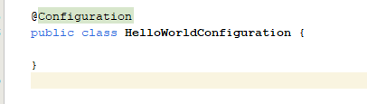

Configuration
* Untuk membuat ApplicationContext menggunakan Annotation, pertama kita bisa perlu membuat Configuration class
* Configuration Class adalah sebuah class yang terdapat annotation @Configuration pada class tersebut

* Kode : HelloWorldConfiguration

* Penjelasannya :

 
### Link Video Youtube
#### (TUTORIAL SPRING BOOT DASAR)
[https://www.youtube.com/watch?v=VM3rwdMBORY]