### Dependency Injection
* Saat kita membuat object, sudah pasti kita sering membuat object yang tergantung dengan object lain
* Dependency Injection (DI) adalah teknik dimana kita bisa mengotomatisasi proses pembuatan object yang tergantung dengan object lain, atau kita sebut dependencies
* Dependencies akan secara otomatis di-inject (dimasukkan) kedalam object yang membutuhkannya
* Spring Framework sejak awal dibilang sebuah framework IoC yang memang cara kerjanya menggunakan 

 
#### Tanpa Dependency Injection
* Sebenarnya tanpa Dependency Injection pun, kita tetap bisa membuat aplikasi
* Namun ketika relasi antar dependencies sangat kompleks, agak ribet untuk kita melakukannya jika harus manual
* Oleh karena itu, penggunaan Dependency Injection framework seperti Spring sangat membantu sekali
* Kode : Class FoorBar

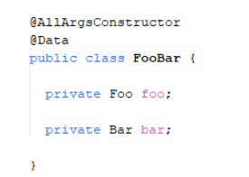
 
* Kode : Tanpa Dependency Injection

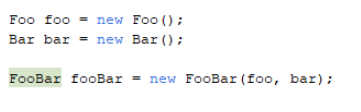
 
#### Spring Dependency Injection
* Spring sejak awal dikenal dengan framework untuk Dependency Injection
* Ketika kita membuat method untuk bean di Spring, kita bisa menambahkan parameter 
* Secara otomatis Spring akan mencarikan bean lain yang sesuai dengan tipe parameter tersebut
* Jika ternyata tidak ada bean yang cocok, maka secara otomatis akan terjadi error
* Dan jika ternyata terdapat bean lebih dari satu, secara otomatis akan terjadi error, kecuali terdapat primary bean
* Kode : Bean Dependency Injection

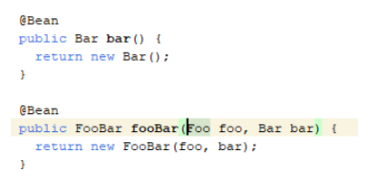
 
* Kode : Menggunakan Dependency Injection

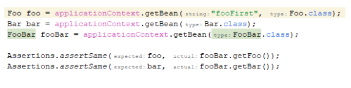
 
 
 
#### Memilih Dependency
* Kadang saat menggunakan DI, kita ingin memilih object mana yang ingin kita gunakan
* Saat terdapat duplicate bean dengan tipe data yang sama, secara otomatis Spring akan memilih bean yang primary
* Namun kita juga bisa memilih secara manual jika memang kita inginkan
* Kita bisa menggunakan annotation @Qualifier(value=”namaBean”) pada parameter di method nya
* Kode : Memilih Dependency

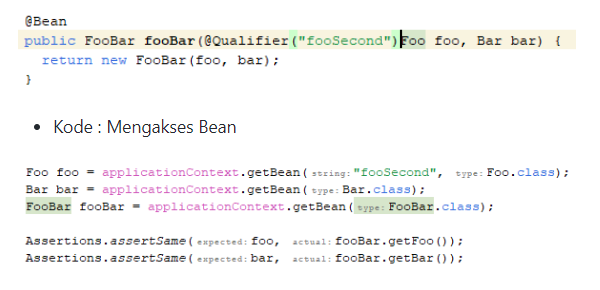
 
 
* Kode : Mengakses Bean

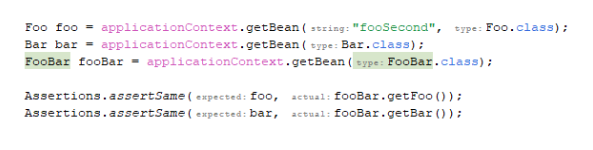
 
 
 
#### Circular Dependencies
* Hati-hati dengan curcular dependencies
* Circular dependencies adalah kasus dimana sebuah lingkaran dependency terjadi, misal bean A membutuhkan bean B, bean B membutuhkan bean C, dan ternyata bean C membutuhkan A
* Jika terjadi cyclic seperti ini, secara otomatis Spring bisa mendeteksinya, dan akan mengganggap bahwa itu adalah error
 
* Kode : Contoh Circular Configuration

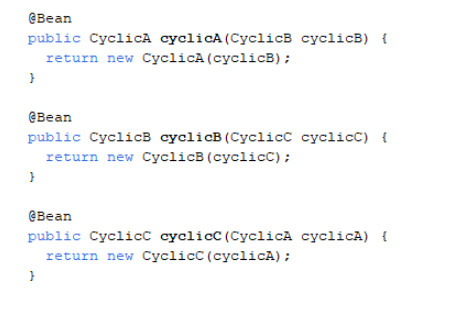
 
* Kode : Error Circular Dependencies
 
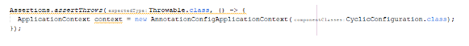
 
 
### Dependency Injection
* Sebelumnya untuk melakukan Dependency Injection di @Bean, kita bisa menambah parameter di method nya
* Secara otomatis Spring akan memilih bean mana yang cocok untuk parameter tersebut *  Bagaimana jika menggunakan @Component?
* Untuk @Component kita bisa melakukan beberapa cara untuk Dependency Injection nya
 
### Constructor-based Dependency Injection
* Pertama yang bisa kita lakukan untuk Dependency Injection di @Component adalah menggunakan constructor parameter
* Kita bisa menambahkan constructor yang memiliki parameter jika membutuhkan bean lain
* Secara otomatis Spring akan mencarikan bean tersebut, dan ketika membuat bean @Component, Spring akan menggunakan bean yang dibutuhkan di constructor
* Constructor-based Dependency Injection hanya mendukung satu constructor, jadi pastikan kita hanya membuat satu constructor
* Kode : Constructor-based DI
 
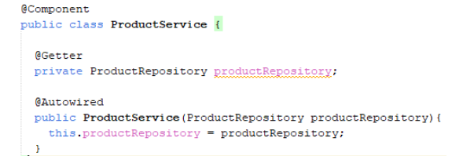
 

* Kode : Mengakses Bean
 
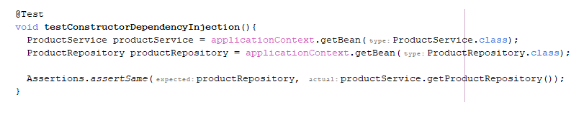
 
 
### Setter-based Dependency Injection
* Selain menggunakan constructor parameter, kita juga bisa menggunakan setter method jika ingin melakukan dependency injection
* Namun khusus untuk setter method, kita perlu menambah annotation @Autowired pada setter method nya
* Secara otomatis Spring akan mencari bean yang dibutuhkan di setter method yang memiliki annotation @Autowired
* Setter-based DI juga bisa digabung dengan Constructor-based DI
* Kode : Settter-based DI

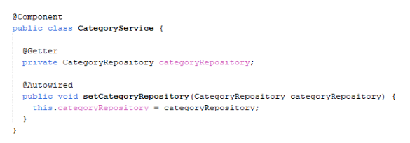
 
* Kode : Mengakses Bean

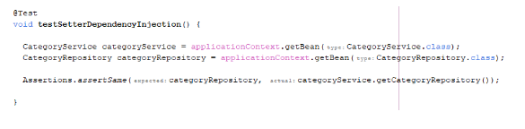
 
### Field-based Dependency Injection
* Selain constructor dan setter, kita juga bisa melakukan dependency injection langsung menggunakan field
* Caranya sama dengan setter, kita bisa tambahkan @Autowired pada fieldnya
* Secara otomatis Spring akan mencari bean dengan tipe data tersebut
* Field-based DI bisa digabung sekaligus dengan Setter-based DI dan Constructor-based DI
* Khusus Field-based DI, Spring sendiri sudah tidak merekomendasikan penggunaan cara melakukan DI dengan Field
* Kode : Field-based DI

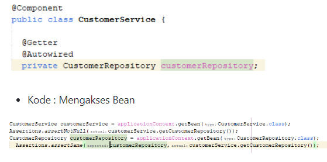
 
* Kode : Mengakses Bean
 
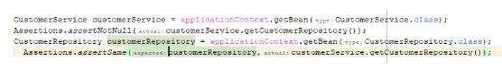
 
 
### Optional Dependency
* Secara default, semua dependency itu wajib
* Artinya  jika Spring tidak bisa menemukan bean yang dibutuhkan pada saat DI, maka secara otomatis akan terjadi error
* Namun jika kita memang ingin membuat sebuah dependency menjadi Optional, artinya tidak wajib
* Kita bisa wrap dependency tersebut dengan menggunakan java.util.Optional<T>
* Secara otomatis jika ternyata bean yang dibutuhkan tidak ada, maka tidak akan terjadi error
* Kita bisa gunakan Optional<T> pada @Bean (method parameter) ataupun @Component (constructor parameter, setter method parameter, field)

* Kode : Optional Configuration

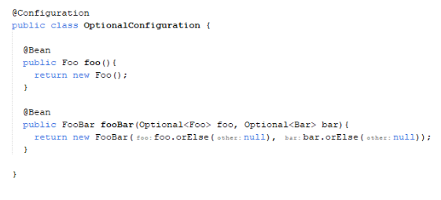

* Kode : Mengakses Bean
 
 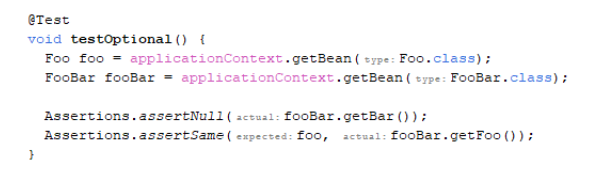
 