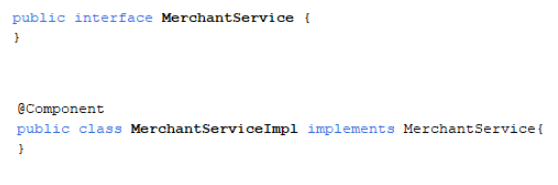
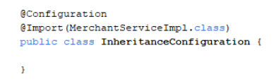
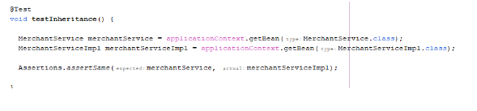

 
### Inheritance
* Saat kita mengakses bean, kita bisa langsung menyebutkan tipe class bean tersebut, atau bisa juga dengan parent class / parent interface bean
* Misal jika kita memiliki sebuah interface bernama MerchantService, lalu kita memiliki bean dengan object implementasi class nya MerchantServiceImpl, maka untuk mengakses bean nya, kita tidak hanya bisa menggunakan tipe MerchantServiceImpl, namun juga bisa dengan MerchantService
* Namun perlu berhati-hati, jika misal MerchantService memiliki banyak bean turunan, pastikan tidak terjadi error duplicate
* Kode : MerchantService
 

 

* Kode : Configuration

 
 
* Kode : Mengakses Bean

 