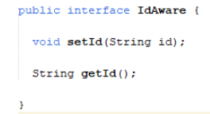
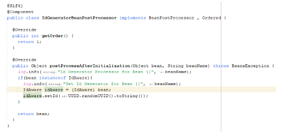
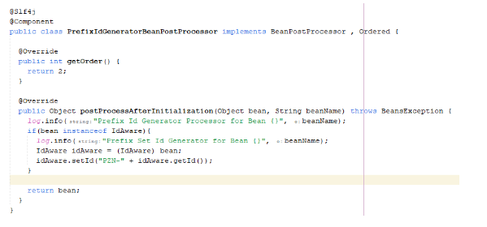
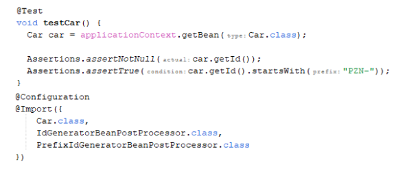

### Ordered
* Saat kita membuat Bean Post Processor, kita bisa membuat lebih dari satu
* Kadang ada kasus saat membuat beberapa Bean Post Processor, kita ingin membuat yang berurutan
* Sayangnya secara default, Spring tidak menjamin urutan eksekusi nya
* Agar kita bisa menentukan urutannya, kita bisa menggunakan interface Ordered
* [https://docs.spring.io/spring-framework/docs/current/javadoc-api/org/springframework/core/Ordered.html] 
* Kode : Id Aware
 

 

* Kode : Id Generator

 
 
* Kode : Prefix Id Generator

 
 
* Kode : Mengakses Bean

 
 