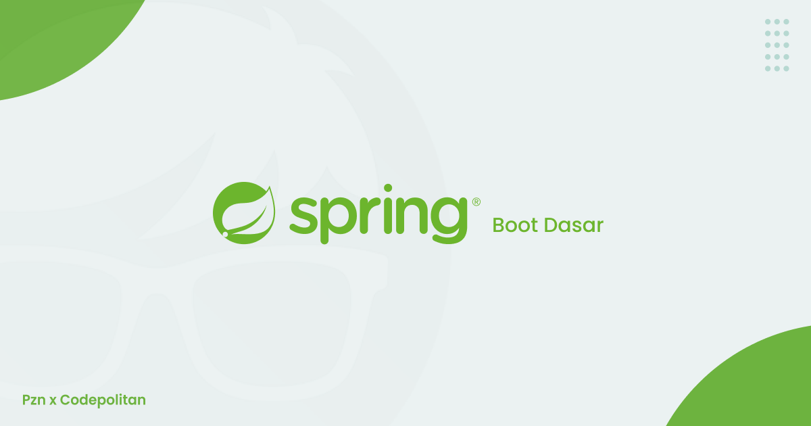
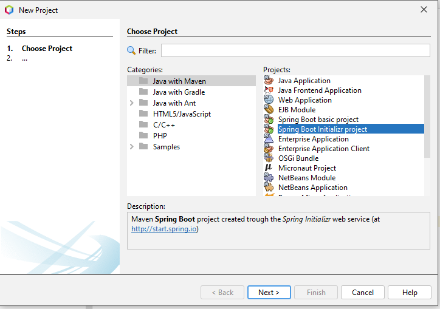
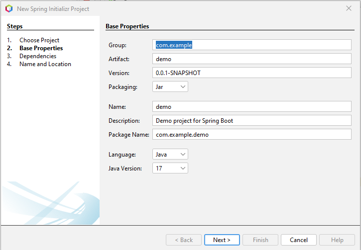
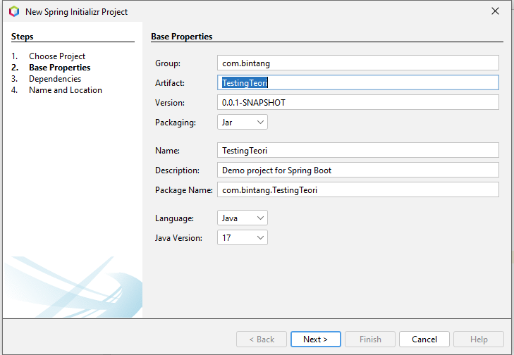
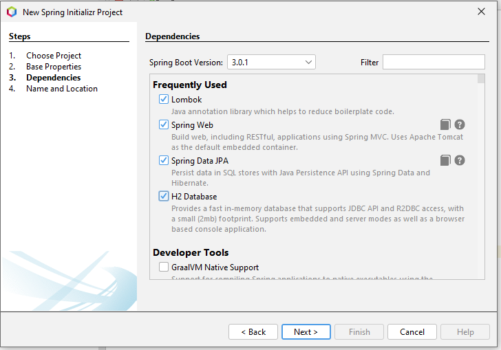
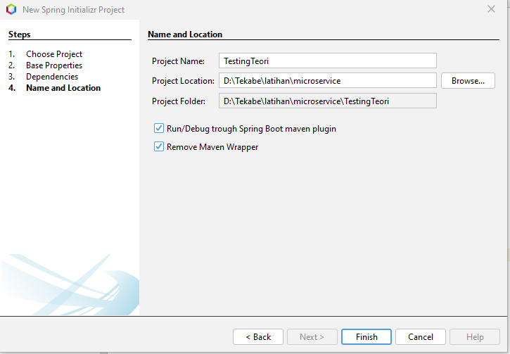
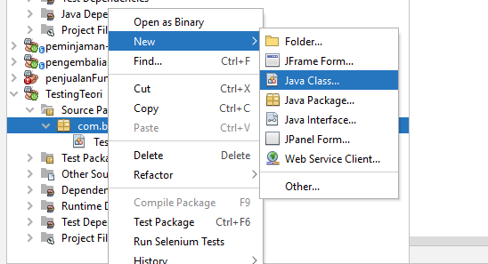
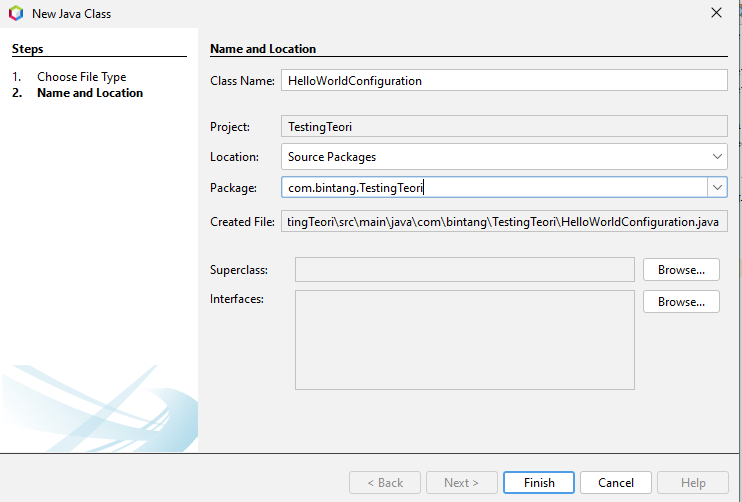

# TUTORIAL SPRING BOOT DASAR

## Agenda

* Pengenalan Spring
* Inversion Of Control
* Application Context
* Depedency Injection
* Bean
* Life Cycle
* Event Listener
* Dan lain-lain

### Pengenalan Spring Framework
* Spring Framework adalah framework paling populer di Java
* Saking Populernya,Spring Framework sampai mengalahkan popularitas Java Enterprise sendiri
* Spring Framework Semakin Populer karena sangat ringan dan mudah digunakan dibandingkan Java Enterprise
* [https://spring.io/]

### Pengenalan Spring Boot
* Spring Boot merupakan framework untuk mempermudah pembuatan aplikasi Spring Framework
* Dahulu untuk menggunakan Spring Framework, untuk pemula tidaklah mudah, karena terlalu banyak yang harus dilakukan sebelum bisa membuat aplikasi
* Spring Boot menjadikan kompleksitas tersebut ditangani secara otomatis oleh Spring Boot, sehingga kita bisa membuat aplikasi * Spring Framework secara cepat tanpa harus melakukan pengaturan apapun
* Spring Boot sekarang sudah menjadi salah satu framework wajib ketika kita ingin membuat aplikasi Spring Framework

### Kenapa Menggunakan Spring?
* Tidak bisa dipungkiri, saat ini Spring adalah satu-satunya framework paling populer di Java
* Belum ada yang bisa menandingi popularitasnya di Java
* Saking populernya, bahkan banyak perusahaan pindah ke JVM karena ingin menggunakan Spring-nya, bukan Java
* Dengan banyaknya bahasa yang bisa berjalan di atas JVM, seperti Kotlin, Groovy dan Scala, maka secara programmer punya banyak pilihan bahasa pemrograman ketika menggunakan Spring Spring juga sudah banyak sekali diadopsi di banyak perusahaan, baik itu skala besar atau kecil
 
### Ekosistem Pendukung
* Spring memiliki ekosistem pendukung yang sangat besar
* Spring sendiri tidaklah digunakan untuk menggantikan framework yang sudah ada, melainkan menjahit framework-framework yang sudah ada, menjadi framework yang saling terintegrasi
* Spring bisa digunakan terintegrasi dengan baik dengan Bean Validation, Java Persistence API, Servlet, dan lain-lain
* Selain itu juga Spring bisa diintegrasikan dengan teknologi yang tidak standar bawaan Java, seperti MongoDB, Consul, Vault, Cassandra, dan lain-lain

* Membuat Project
[https://start.spring.io/]  

- Langkah awal adalah dengan cara membuat project ctrl + shift + N 

- Selanjutnya Pilih Spring Boot Initializer Project
- Lalu Next

- Ganti Group,Artifact,PackageName,dan sesuaikan java version dengan version java di laptop anda
- Kemudian Klik Next
- dan Setelah diganti maka akan terlihat seperti dibawah berikut

- Lalu Bikin Project Name

- Lalu pilih depencies yang akan digunakan

- dan Kemudian Tekan Finish

##### Langkah-Langkah diatas hanya bisa dilakukan setelah memasang extensi dari springboot di Apache netbeans

* Create File
- Pertama kita klik icon new
- lalu pilih java class

- lalu buat nama class-nya
seperti gambar dibawah berikut

 
### Inversion of Control
* Inversion of Control (IoC) merupakan prinsip dalam pembuatan perangkat lunak, dimana kita melakukan pemindahan kontrol untuk objek atau program ke sebuah container di framework
* Tidak seperti biasanya ketika kita membuat aplikasi, dimana kita selalu melakukannya secara manual, dalam IoC, kita menyerahkan banyak pekerjakan ke container IoC 
* Container IoC memiliki kontrol untuk melakukan eksekusi program kita, memanajemen object pada program kita dan melakukan abstraction terhadap program kita
* Saat menggunakan framework IoC, kita biasanya akan mengikuti cara kerja framework tersebut
Spring Inversion of Control
* Spring bisa dibilang adalah framework IoC, dimana kita akan menyerahkan banyak sekali pekerjaan dalam program kita ke Spring
* Kode program kita akan mengikuti cara kerja Spring
Diagram Inversion of Control
 
  
 
### Link Video Youtube
#### (TUTORIAL SPRING BOOT DASAR)
[https://www.youtube.com/watch?v=VM3rwdMBORY]