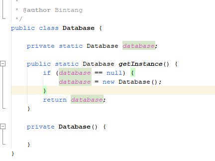

### Singleton
* Singleton adalah salah satu Design Patterns untuk pembuatan objek, dimana sebuah object hanya dibuat satu kali saja
* Dan ketika kita membutuhkan object tersebut, kita hanya akan menggunakan object yang sama * [https://refactoring.guru/design-patterns/singleto] 
Membuat Singleton di Java
* Ada banyak cara membuat singleton object di Java
* Cara yang paling sering digunakan adalah membuat class yang berisikan static method untuk membuat object dirinya sendiri
* Selanjutnya constructor nya dibuat private, agar tidak bisa diakses dari luar
* Sehingga user terpaksa menggunakan method static tersebut ketika ingin membuat object nya
* Kode : Singleton Class

* Penjelasannya :

 
### Link Video Youtube
#### (TUTORIAL SPRING BOOT DASAR)
[https://www.youtube.com/watch?v=VM3rwdMBORY]