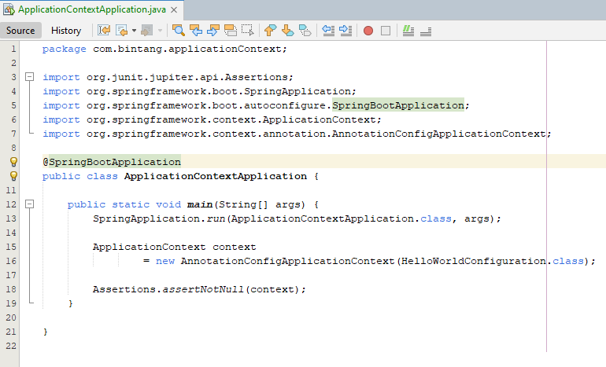

Membuat Application Context
* Selanjutnya, setelah membuat Class Configuration, kita bisa menggunakan class AnnotationConfigApplicationContext untuk membuat Application Context
* [https://docs.spring.io/spring-framework/docs/current/javadoc-api/org/springframework/context/annotation/AnnotationConfigApplicationContext.html] 
* Kode : Membuat Application Context

* Penjelasannya :

 
### Link Video Youtube
#### (TUTORIAL SPRING BOOT DASAR)
[https://www.youtube.com/watch?v=VM3rwdMBORY]