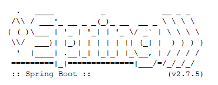

### Banner
* Spring Boot memiliki fitur banner, dimana saat aplikasi Spring Boot berjalan, kita bisa menampilkan tulisan banner di console
* Secara default fitur banner ini akan menyala dan akan mencari tulisan banner di classpath dengan nama banner.txt
* Jika tidak ada file tersebut, maka secara otomatis akan menampilkan tulisan banner Spring Boot
* Salah satu contoh tempat untuk membuat banner adalah [http://www.bagill.com/ascii-sig.php]
* Kode : Default Banner
 

* Kode : banner.txt

 
* Kode : Hasil Banner

