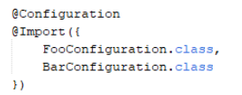
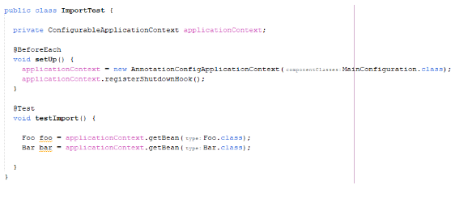

### Import
* Saat nanti kita membuat aplikasi, tidak mungkin kita hanya akan membuat satu Configuration Class
* Biasanya kita akan membuat banyak sekali, tergantung seberapa kompleks aplikasi kita
* Spring mendukung import Configuration Class lain jika dibutuhkan
* Kita bisa menggunakan annotation @Import, lalu sebutkan Configuration Class mana yang ingin kita import
* Ketika kita melakukan import, kita bisa import lebih dari satu class
* [https://docs.spring.io/spring-framework/docs/current/javadoc-api/org/springframework/context/annotation/Import.html] 
* Kode : Foo dan Bar Configuration
 
* Kode : Import Configuration
 

 

* Kode : Mengakses Bean
 

 