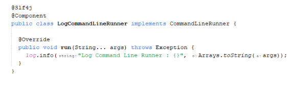
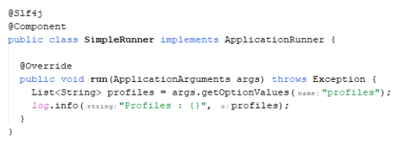

 
### Command Line Runner
* Saat kita membuat aplikasi, kadang kita butuh argument yang diberikan pada main method
* Spring Application bisa mengirim data argument tersebut secara otomatis ke bean yang kita buat
* Kita hanya butuh membuat bean dari CommandLineRunner
* CommandLineRunner secara otomatis akan di jalankan ketika Spring Application berjalan
* [https://docs.spring.io/spring-boot/docs/current/api/org/springframework/boot/CommandLineRunner.html] 
* Kode : Contoh Command Line Runner
 
 
 
 
 
### Application Runner
* Selain CommandLineRunner, Spring Boot menyediakan fitur ApplicationRunner
* Penggunaan ApplicationRunner sama seperti CommandLineRunnnner, hanya saja argument nya sudah di wrap dalam object ApplicationArguments
* Yang menarik dari ApplicationArguments adalah, memiliki fitur parsing untuk command line argument
* [https://docs.spring.io/spring-boot/docs/current/api/org/springframework/boot/ApplicationArguments.html]
* [https://docs.spring.io/spring-boot/docs/current/api/org/springframework/boot/ApplicationRunner.html] 
* Kode : Application Runner
 

 